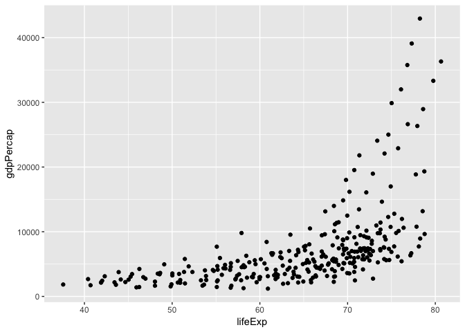
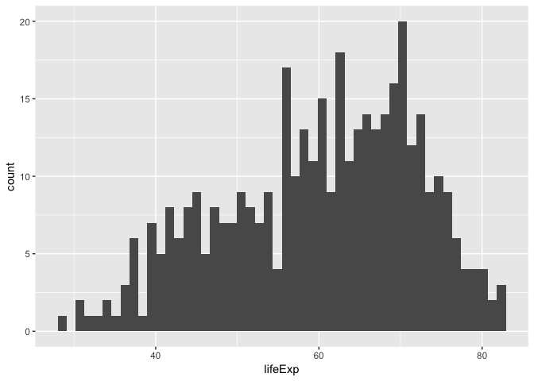
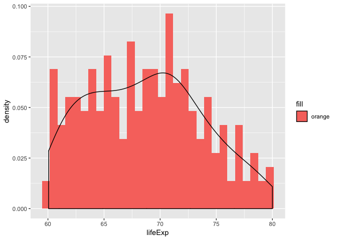
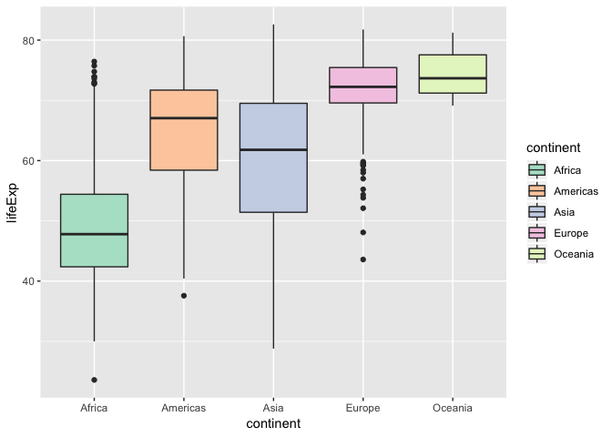
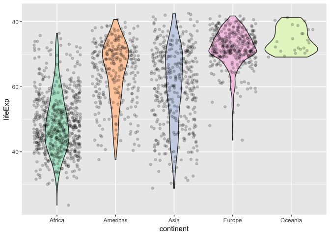
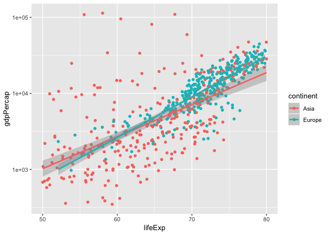

hw02-Explore Gapminder and use dplyr
================
JennyHuang
2018-09-20

Load the data

``` r
install.packages("gapminder")
```

    ## 
    ## The downloaded binary packages are in
    ##  /var/folders/kp/7m5qwjbn55dbqyxq4xcvvz_m0000gp/T//RtmpJKsukZ/downloaded_packages

``` r
install.packages("tidyverse")
```

    ## 
    ## The downloaded binary packages are in
    ##  /var/folders/kp/7m5qwjbn55dbqyxq4xcvvz_m0000gp/T//RtmpJKsukZ/downloaded_packages

``` r
library(gapminder)
library(tidyverse)
```

    ## ── Attaching packages ──────────────────────────────────────────────────── tidyverse 1.2.1 ──

    ## ✔ ggplot2 3.0.0     ✔ purrr   0.2.5
    ## ✔ tibble  1.4.2     ✔ dplyr   0.7.6
    ## ✔ tidyr   0.8.1     ✔ stringr 1.3.1
    ## ✔ readr   1.1.1     ✔ forcats 0.3.0

    ## ── Conflicts ─────────────────────────────────────────────────────── tidyverse_conflicts() ──
    ## ✖ dplyr::filter() masks stats::filter()
    ## ✖ dplyr::lag()    masks stats::lag()

\#Smell test the data Before exploring the dataset in detail, I will
take a look at the head and tail of the dataset.

``` r
head(gapminder) ## this allows us to see the top six rows of the data
```

    ## # A tibble: 6 x 6
    ##   country     continent  year lifeExp      pop gdpPercap
    ##   <fct>       <fct>     <int>   <dbl>    <int>     <dbl>
    ## 1 Afghanistan Asia       1952    28.8  8425333      779.
    ## 2 Afghanistan Asia       1957    30.3  9240934      821.
    ## 3 Afghanistan Asia       1962    32.0 10267083      853.
    ## 4 Afghanistan Asia       1967    34.0 11537966      836.
    ## 5 Afghanistan Asia       1972    36.1 13079460      740.
    ## 6 Afghanistan Asia       1977    38.4 14880372      786.

``` r
tail(gapminder) ## this allows us to see the bottom six rows of the data
```

    ## # A tibble: 6 x 6
    ##   country  continent  year lifeExp      pop gdpPercap
    ##   <fct>    <fct>     <int>   <dbl>    <int>     <dbl>
    ## 1 Zimbabwe Africa     1982    60.4  7636524      789.
    ## 2 Zimbabwe Africa     1987    62.4  9216418      706.
    ## 3 Zimbabwe Africa     1992    60.4 10704340      693.
    ## 4 Zimbabwe Africa     1997    46.8 11404948      792.
    ## 5 Zimbabwe Africa     2002    40.0 11926563      672.
    ## 6 Zimbabwe Africa     2007    43.5 12311143      470.

To determine whether ‘gapminder’ is a list, a vector, a matrix, or a
dataframe, we can use `str()`
function:

``` r
str(gapminder) # this tells use that gapminder is a tibble, a dataframe that make working in the tidyverse easier. 
```

    ## Classes 'tbl_df', 'tbl' and 'data.frame':    1704 obs. of  6 variables:
    ##  $ country  : Factor w/ 142 levels "Afghanistan",..: 1 1 1 1 1 1 1 1 1 1 ...
    ##  $ continent: Factor w/ 5 levels "Africa","Americas",..: 3 3 3 3 3 3 3 3 3 3 ...
    ##  $ year     : int  1952 1957 1962 1967 1972 1977 1982 1987 1992 1997 ...
    ##  $ lifeExp  : num  28.8 30.3 32 34 36.1 ...
    ##  $ pop      : int  8425333 9240934 10267083 11537966 13079460 14880372 12881816 13867957 16317921 22227415 ...
    ##  $ gdpPercap: num  779 821 853 836 740 ...

`str()` function not only tells the type/class of gapminder, it also
shows that this dataset contains 1704 observations and 6 variables.

We can also use `class()` to explore the type of gapminder.

``` r
class(gapminder)
```

    ## [1] "tbl_df"     "tbl"        "data.frame"

`class()`function also confirms that gapminder is a dataframe\!

Although `str()` already tells number of columns and rows in gapminder,
there are different command we can use to check it.

``` r
ncol(gapminder) ## column=6
```

    ## [1] 6

``` r
nrow(gapminder)  ## row=1704
```

    ## [1] 1704

To check data type of each variable, we can also use
    `str()`

``` r
str(gapminder)
```

    ## Classes 'tbl_df', 'tbl' and 'data.frame':    1704 obs. of  6 variables:
    ##  $ country  : Factor w/ 142 levels "Afghanistan",..: 1 1 1 1 1 1 1 1 1 1 ...
    ##  $ continent: Factor w/ 5 levels "Africa","Americas",..: 3 3 3 3 3 3 3 3 3 3 ...
    ##  $ year     : int  1952 1957 1962 1967 1972 1977 1982 1987 1992 1997 ...
    ##  $ lifeExp  : num  28.8 30.3 32 34 36.1 ...
    ##  $ pop      : int  8425333 9240934 10267083 11537966 13079460 14880372 12881816 13867957 16317921 22227415 ...
    ##  $ gdpPercap: num  779 821 853 836 740 ...

From `str()` output, we can see that: \* country is factor \* continent
is factor \* year is integar \* lifeExp is number \* population is
integar

\#Explore individual variables First, I will select variables I want to
explore from gapminder

``` r
life=gapminder$lifeExp ## this is a quantitative variable
continent=gapminder$continent ## this is a categorical variable
```

There are different ways to check the range of individual variables. The
`range()`, `min()`, `max()` function tells us the possible values of
life expectancy.

``` r
range(life) ## gives the range of life expendence 
```

    ## [1] 23.599 82.603

``` r
min(life)
```

    ## [1] 23.599

``` r
max(life)
```

    ## [1] 82.603

For categorical variable, we can use `table()` function to check the
count value under each categories.

``` r
table(continent) ## example of a categorical variable
```

    ## continent
    ##   Africa Americas     Asia   Europe  Oceania 
    ##      624      300      396      360       24

Explore various plot types First, I want to explore the relationship
between life expectancy and gdp per capita in Americas.

``` r
gapminder %>% 
  filter(continent=='Americas') %>% 
  ggplot(aes(lifeExp, gdpPercap))+geom_point()
```

<!-- -->
Noticed the relationship between life expectancy and gdp per capita in
Americas, now I want to explore life expectancy along, see how the data
is distributed. Let’s explore this within Asia countries this time

``` r
gapminder %>% 
  filter(continent=='Asia') %>% 
  ggplot( aes(lifeExp))+
  geom_histogram(bins=50)
```

<!-- -->
What does it look like when life expectancy is between 60 and 80? This
time I will combine histogram with density plot:

``` r
gapminder %>% 
  filter(continent=='Asia') %>% 
  filter(lifeExp<='80'&lifeExp>='60') %>% 
  ggplot( aes(lifeExp)) +
  geom_histogram(aes(y=..density.., fill="orange"))+
  geom_density()
```

    ## `stat_bin()` using `bins = 30`. Pick better value with `binwidth`.

<!-- -->
How does the life expectancy varies among continents? One way to explore
this is to use boxplot

``` r
gapminder %>% 
  ggplot(aes(continent,lifeExp, fill=continent)) +
  geom_boxplot()+
  scale_fill_brewer(palette = "Pastel2")
```

<!-- -->
Another way to look at this is using the combination of violin and
jitter. This will maximize the presentation of actual data.

``` r
gapminder %>% 
  ggplot(aes(continent,lifeExp, fill=continent)) +
geom_violin()+
  geom_jitter(alpha =0.2)+
  scale_fill_brewer(palette = "Pastel2")+
  guides(fill=FALSE) ## Noticed from bove boxplot, we propobaly don't need a legend since it already show color for each continent
```

<!-- -->

Use filter(), select() and %\>% Now I will use both `filter()` and
`select()`, and piping into `ggplot()`. This time let explore the
relationship between life expectancy range from 50 to 80 and gdp per
capita in a different scale.

``` r
gapminder %>% 
  select(continent,lifeExp,gdpPercap) %>% 
  filter(continent=='Europe'|continent=='Asia') %>% 
  filter(lifeExp<='80'&lifeExp>='50') %>% 
  ggplot(aes(lifeExp, gdpPercap, color=continent)) +
  geom_point()+
  scale_y_log10() +
  geom_smooth(method = "lm") +
  scale_fill_brewer(palette = "Pastel2")
```

<!-- -->
But I want to do more\! Evaluate this code and describe the result.
Presumably the analyst’s intent was to get the data for Rwanda and
Afghanistan.

``` r
filter(gapminder, country == c("Rwanda", "Afghanistan"))
```

    ## # A tibble: 12 x 6
    ##    country     continent  year lifeExp      pop gdpPercap
    ##    <fct>       <fct>     <int>   <dbl>    <int>     <dbl>
    ##  1 Afghanistan Asia       1957    30.3  9240934      821.
    ##  2 Afghanistan Asia       1967    34.0 11537966      836.
    ##  3 Afghanistan Asia       1977    38.4 14880372      786.
    ##  4 Afghanistan Asia       1987    40.8 13867957      852.
    ##  5 Afghanistan Asia       1997    41.8 22227415      635.
    ##  6 Afghanistan Asia       2007    43.8 31889923      975.
    ##  7 Rwanda      Africa     1952    40    2534927      493.
    ##  8 Rwanda      Africa     1962    43    3051242      597.
    ##  9 Rwanda      Africa     1972    44.6  3992121      591.
    ## 10 Rwanda      Africa     1982    46.2  5507565      882.
    ## 11 Rwanda      Africa     1992    23.6  7290203      737.
    ## 12 Rwanda      Africa     2002    43.4  7852401      786.

Above code showed that there are 6 records for each of Rwanda and
Afghanistan. Let validate it with Rwanda data alone

``` r
filter(gapminder, country == "Rwanda")
```

    ## # A tibble: 12 x 6
    ##    country continent  year lifeExp     pop gdpPercap
    ##    <fct>   <fct>     <int>   <dbl>   <int>     <dbl>
    ##  1 Rwanda  Africa     1952    40   2534927      493.
    ##  2 Rwanda  Africa     1957    41.5 2822082      540.
    ##  3 Rwanda  Africa     1962    43   3051242      597.
    ##  4 Rwanda  Africa     1967    44.1 3451079      511.
    ##  5 Rwanda  Africa     1972    44.6 3992121      591.
    ##  6 Rwanda  Africa     1977    45   4657072      670.
    ##  7 Rwanda  Africa     1982    46.2 5507565      882.
    ##  8 Rwanda  Africa     1987    44.0 6349365      848.
    ##  9 Rwanda  Africa     1992    23.6 7290203      737.
    ## 10 Rwanda  Africa     1997    36.1 7212583      590.
    ## 11 Rwanda  Africa     2002    43.4 7852401      786.
    ## 12 Rwanda  Africa     2007    46.2 8860588      863.

From above code, clearly there are more than 6 records for Rwanda, that
means the code provided was incorrect because it lead to miss data.

Here are two ways to correct this:

``` r
filter(gapminder, country %in% c("Rwanda", "Afghanistan"))
```

    ## # A tibble: 24 x 6
    ##    country     continent  year lifeExp      pop gdpPercap
    ##    <fct>       <fct>     <int>   <dbl>    <int>     <dbl>
    ##  1 Afghanistan Asia       1952    28.8  8425333      779.
    ##  2 Afghanistan Asia       1957    30.3  9240934      821.
    ##  3 Afghanistan Asia       1962    32.0 10267083      853.
    ##  4 Afghanistan Asia       1967    34.0 11537966      836.
    ##  5 Afghanistan Asia       1972    36.1 13079460      740.
    ##  6 Afghanistan Asia       1977    38.4 14880372      786.
    ##  7 Afghanistan Asia       1982    39.9 12881816      978.
    ##  8 Afghanistan Asia       1987    40.8 13867957      852.
    ##  9 Afghanistan Asia       1992    41.7 16317921      649.
    ## 10 Afghanistan Asia       1997    41.8 22227415      635.
    ## # ... with 14 more rows

``` r
filter(gapminder, country == "Rwanda" | country == "Afghanistan")
```

    ## # A tibble: 24 x 6
    ##    country     continent  year lifeExp      pop gdpPercap
    ##    <fct>       <fct>     <int>   <dbl>    <int>     <dbl>
    ##  1 Afghanistan Asia       1952    28.8  8425333      779.
    ##  2 Afghanistan Asia       1957    30.3  9240934      821.
    ##  3 Afghanistan Asia       1962    32.0 10267083      853.
    ##  4 Afghanistan Asia       1967    34.0 11537966      836.
    ##  5 Afghanistan Asia       1972    36.1 13079460      740.
    ##  6 Afghanistan Asia       1977    38.4 14880372      786.
    ##  7 Afghanistan Asia       1982    39.9 12881816      978.
    ##  8 Afghanistan Asia       1987    40.8 13867957      852.
    ##  9 Afghanistan Asia       1992    41.7 16317921      649.
    ## 10 Afghanistan Asia       1997    41.8 22227415      635.
    ## # ... with 14 more rows

Present numerical tables in a more attractive form, such as using
knitr::kable().

``` r
a=filter(gapminder, country %in% c("Rwanda", "Afghanistan"))
knitr::kable(a)
```

| country     | continent | year | lifeExp |      pop | gdpPercap |
| :---------- | :-------- | ---: | ------: | -------: | --------: |
| Afghanistan | Asia      | 1952 |  28.801 |  8425333 |  779.4453 |
| Afghanistan | Asia      | 1957 |  30.332 |  9240934 |  820.8530 |
| Afghanistan | Asia      | 1962 |  31.997 | 10267083 |  853.1007 |
| Afghanistan | Asia      | 1967 |  34.020 | 11537966 |  836.1971 |
| Afghanistan | Asia      | 1972 |  36.088 | 13079460 |  739.9811 |
| Afghanistan | Asia      | 1977 |  38.438 | 14880372 |  786.1134 |
| Afghanistan | Asia      | 1982 |  39.854 | 12881816 |  978.0114 |
| Afghanistan | Asia      | 1987 |  40.822 | 13867957 |  852.3959 |
| Afghanistan | Asia      | 1992 |  41.674 | 16317921 |  649.3414 |
| Afghanistan | Asia      | 1997 |  41.763 | 22227415 |  635.3414 |
| Afghanistan | Asia      | 2002 |  42.129 | 25268405 |  726.7341 |
| Afghanistan | Asia      | 2007 |  43.828 | 31889923 |  974.5803 |
| Rwanda      | Africa    | 1952 |  40.000 |  2534927 |  493.3239 |
| Rwanda      | Africa    | 1957 |  41.500 |  2822082 |  540.2894 |
| Rwanda      | Africa    | 1962 |  43.000 |  3051242 |  597.4731 |
| Rwanda      | Africa    | 1967 |  44.100 |  3451079 |  510.9637 |
| Rwanda      | Africa    | 1972 |  44.600 |  3992121 |  590.5807 |
| Rwanda      | Africa    | 1977 |  45.000 |  4657072 |  670.0806 |
| Rwanda      | Africa    | 1982 |  46.218 |  5507565 |  881.5706 |
| Rwanda      | Africa    | 1987 |  44.020 |  6349365 |  847.9912 |
| Rwanda      | Africa    | 1992 |  23.599 |  7290203 |  737.0686 |
| Rwanda      | Africa    | 1997 |  36.087 |  7212583 |  589.9445 |
| Rwanda      | Africa    | 2002 |  43.413 |  7852401 |  785.6538 |
| Rwanda      | Africa    | 2007 |  46.242 |  8860588 |  863.0885 |

Use more of the dplyr functions for operating on a single table.

Using above table as an example, I will add a column call GDP that
contains the GDP value for each countries.

``` r
gapminder%>% 
  filter(country %in% c("Rwanda", "Afghanistan")) %>% 
  mutate(GPD=pop*gdpPercap)
```

    ## # A tibble: 24 x 7
    ##    country     continent  year lifeExp      pop gdpPercap          GPD
    ##    <fct>       <fct>     <int>   <dbl>    <int>     <dbl>        <dbl>
    ##  1 Afghanistan Asia       1952    28.8  8425333      779.  6567086330.
    ##  2 Afghanistan Asia       1957    30.3  9240934      821.  7585448670.
    ##  3 Afghanistan Asia       1962    32.0 10267083      853.  8758855797.
    ##  4 Afghanistan Asia       1967    34.0 11537966      836.  9648014150.
    ##  5 Afghanistan Asia       1972    36.1 13079460      740.  9678553274.
    ##  6 Afghanistan Asia       1977    38.4 14880372      786. 11697659231.
    ##  7 Afghanistan Asia       1982    39.9 12881816      978. 12598563401.
    ##  8 Afghanistan Asia       1987    40.8 13867957      852. 11820990309.
    ##  9 Afghanistan Asia       1992    41.7 16317921      649. 10595901589.
    ## 10 Afghanistan Asia       1997    41.8 22227415      635. 14121995875.
    ## # ... with 14 more rows
